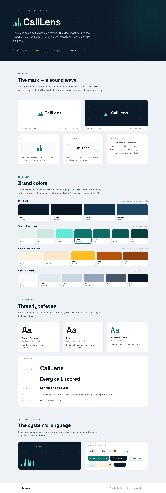
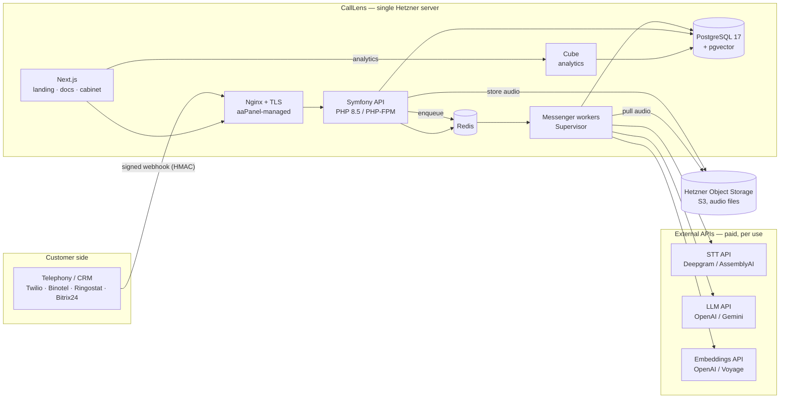

# CallLens — Project Specification (Technical Brief)

> **Working title:** CallLens — an AI SaaS that ingests sales‑team phone calls, transcribes them with speaker separation, scores each sales rep against a configurable scorecard with an LLM, builds embeddings for semantic search, and exposes reports and analytics.
>
> This document is the single source of truth for building the project. It is the canonical build brief for the engineering team.
>
> **Versioning note:** versions below are "latest stable as of June 2026". Before installing, verify the newest patch release and pin exact versions in `composer.json` / `package.json`. Do not use unpinned `latest` tags in production images.

---

## Quickstart

The only prerequisite is **Docker** (with Compose v2). No local PHP or Node is needed — everything runs in containers.

```bash
make init     # copies .env.example → .env and builds the images
make up       # starts the full stack
```

Then open:

| Service | URL | Notes |
|---|---|---|
| API health | http://localhost:8081/internal/health | `{"status":"ok"}` once the DB is up |
| Web (landing / docs / cabinet) | http://localhost:3001 | `/`, `/docs`, `/app` |
| Cube (analytics playground) | http://localhost:4000 | dev mode |
| MinIO console (dev S3) | http://localhost:9001 | login `callens` / `callens-secret` |
| Mailpit (captured email) | http://localhost:8025 | |

Ports are configurable via `API_PORT` / `WEB_PORT` in `.env` (defaults avoid common 8080/3000 clashes). AI providers default to `fake`, so the whole pipeline runs deterministically with **no paid API calls**; set real keys in `.env` to switch.

Common tasks (`make help` lists all):

```bash
make logs S=worker   # tail one service
make sh              # shell into the api container
make migrate         # run Doctrine migrations
make test            # backend + frontend tests
make lint            # PHPStan + php-cs-fixer + ESLint
make down            # stop everything
```

**Services:** `api` (PHP 8.5 / Symfony 7.4 + PHP-FPM), `nginx`, `worker` + `scheduler` (Messenger), `db` (PostgreSQL 17 + pgvector), `redis`, `web` (Next.js), `cube`, plus `minio` + `mailpit` in dev. See the repo layout in §5 and the milestone plan in §21.

**Documentation:** full docs live in [`docs/`](docs/) (start at [`docs/README.md`](docs/README.md)) — architecture, local development, configuration, **credentials (where to get API keys)**, data model, processing pipeline, integrations, authentication & security, webhooks, API reference, frontend, reports, deployment, runbooks, and ADRs. **Build status: M0–M10 implemented** (scaffolding → auth/tenancy → ingestion/pipeline → Deepgram STT → OpenAI scoring → pgvector embeddings & search → cabinet → Cube analytics → audio retention → docs/API docs → security hardening). **M11 (deploy & ops) is the remaining milestone.**

---

## Design & HTML Prototypes

Two static HTML prototypes establish the product's visual language before the Next.js app is built. They live under [`doc/html/`](doc/html/) and full-page screenshots are in [`doc/images/`](doc/images/). These are **design references**, not the production frontend.

### Landing page — [`doc/html/landing.html`](doc/html/landing.html)

The corporate marketing page. It explains the product to a sales-team audience: a four-step onboarding, an end-to-end "journey of a call through the system" architecture diagram, the *why API and not your own GPU* cost argument, the *sound → text → score* transformation, Cube analytics built on PostgreSQL, what "registering a webhook" means, the single-dedicated-server rationale, the tech stack, and a sign-up CTA. Self-contained single file styled with Tailwind (CDN); deep-navy + teal palette with amber accents and an animated waveform motif.

[](doc/html/landing.html)

### Brand guideline — [`doc/html/branding.html`](doc/html/branding.html)

The brand guideline / style guide: the **CallLens** wordmark and waveform logomark with usage do/don'ts, the full color system (Ink navy, Brand teal, **Amber = "external API"**, neutral grays — all with hex values), the type scale (Space Grotesk display, Inter body, IBM Plex Mono code), and tone-of-voice / system-language rules. It's a single self-contained file — its custom-element runtime (which bootstraps React from a CDN to render the page) is inlined directly into the HTML, so no extra assets are needed.

[](doc/html/branding.html)

---

## 1. Goals & Principles

1. **API‑first AI.** All heavy AI work (speech‑to‑text, LLM scoring, embeddings) runs through external HTTP APIs. **No GPU is required.** This keeps a single dedicated server sufficient and infra cheap.
2. **Provider independence.** Every external AI provider sits behind an internal interface so it can be swapped, or later moved to self‑hosted GPU, without touching business logic.
3. **One well‑designed project.** A single Docker‑based monorepo. `docker compose up` gives a complete local environment that mirrors production.
4. **Security by default.** Only the landing site, the authenticated cabinet API, and the signed webhook endpoint are reachable from the internet. Everything else (database, cache, analytics engine, internal/ops endpoints) is bound to the internal network. Endpoints are still fully documented internally.
5. **Documentation is a deliverable.** A maintained `README.md` plus a `docs/` folder. API reference is generated automatically and rendered beautifully (ReDoc / Scalar). Documentation is updated in the same change as the code.
6. **Multi‑tenant SaaS.** Every record is scoped to a tenant (workspace). Strict isolation.
7. **Cost discipline.** Audio is large; processed audio can be auto‑deleted per configuration to save storage.

---

## 2. Scope

### 2.1 MVP (build first)
- Email + Google sign‑up / sign‑in, workspaces (tenants), team members with roles.
- Call ingestion via **signed webhook** and **manual upload** / REST.
- Async processing pipeline: store audio → transcribe (with diarization) → LLM scoring against a scorecard → embeddings → persist.
- Configurable **scorecards** (criteria, weights, guidance).
- **Cabinet** (authenticated SPA): calls list, call detail (transcript + per‑criterion scores + evidence quotes), agents, scorecard editor, semantic search, settings.
- **Reports & analytics** via Cube (avg score per agent, trend over time, top objections, score distribution).
- **Audio retention / deletion** controlled by configuration.
- **Landing page** (corporate) + **documentation site** (how it works, how to connect, what reports are, cabinet guide).
- Auto‑generated **API documentation** (OpenAPI → ReDoc).
- **Git‑based deployment** to a Hetzner dedicated server; backups; monitoring via aaPanel.

### 2.2 Later (design for, don't build yet)
- Real‑time / streaming transcription and live agent assist.
- Self‑hosted STT/LLM on GPU when volume crosses the break‑even (~215k audio‑minutes/month).
- Hybrid search via OpenSearch/Qdrant if vector count or full‑text search outgrows Postgres.
- SSO / SAML, 2FA, fine‑grained RBAC, billing.

---

## 3. High‑Level Architecture



**Synchronous path** (webhook): verify signature → store audio in object storage → create `Call(received)` → enqueue → return `202 Accepted` in milliseconds.
**Asynchronous path** (workers): transcribe → diarize → score → embed → persist → optionally delete audio.

---

## 4. Technology Stack (latest stable, June 2026)

| Layer | Technology | Target version | Notes |
|---|---|---|---|
| Language (backend) | PHP | **8.5** | Use the newest 8.5.x patch. |
| Framework | Symfony | **7.4 LTS** | LTS line (8.0 exists; LTS preferred for a product). |
| API | API Platform | **4.x** | Generates OpenAPI, Swagger UI, ReDoc. |
| ORM | Doctrine ORM | **3.x** | With DBAL 4. |
| Async | Symfony Messenger | (Symfony 7.4) | Redis or Doctrine transport. |
| Workflow | Symfony Workflow | (Symfony 7.4) | Call status state machine. |
| Scheduler | Symfony Scheduler | (Symfony 7.4) | Retention sweeps, housekeeping. |
| Auth (OAuth) | knpuniversity/oauth2-client-bundle + league/oauth2-google | latest | Google login. |
| Auth (JWT) | lexik/jwt-authentication-bundle + gesdinet/jwt-refresh-token-bundle | latest | JWT in **HttpOnly cookie** + refresh rotation. |
| Object storage | Flysystem 3 + AsyncAws S3 | latest | Points at Hetzner Object Storage (S3‑compatible). |
| Database | PostgreSQL | **17** | Primary store + analytics. |
| Vector | pgvector | **0.8.x** | HNSW index for utterance embeddings. |
| Cache / queue broker | Redis | **7.4** | (Valkey 8 acceptable.) |
| Analytics | Cube | latest | Semantic layer + pre‑aggregations over Postgres. |
| Frontend | Next.js (App Router) + React | **15+ / 19** | Landing + docs (MDX) + cabinet. |
| Node runtime | Node.js | **22 LTS** | For Next.js and Cube. |
| Web server | Nginx | 1.27+ | Reverse proxy + TLS (aaPanel‑managed on prod). |
| App server | PHP‑FPM | (PHP 8.5) | Nginx + PHP‑FPM only. Do **not** use FrankenPHP. |
| API docs UI | ReDoc (primary), Scalar (optional) | latest | Rendered from generated OpenAPI. |
| Email | Symfony Mailer | (Symfony 7.4) | Mailpit in dev; transactional provider in prod. |
| Containers | Docker + Docker Compose v2 | latest | Same compose file dev & prod (with overrides). |
| Tests | PHPUnit 11, Playwright, Vitest | latest | Unit, integration, e2e. |
| Static analysis | PHPStan (max), php-cs-fixer, ESLint, Prettier, TypeScript strict | latest | Enforced in CI. |
| Dev S3 | MinIO | latest | Local S3 emulator (prod uses Hetzner). |

---

## 5. Repository Layout (monorepo)

```
callens/
├─ apps/
│  ├─ api/                 # Symfony 7.4 backend (PHP 8.5)
│  │  ├─ src/
│  │  │  ├─ Domain/        # entities, value objects, enums
│  │  │  ├─ Application/   # use cases, message handlers, services
│  │  │  ├─ Infrastructure/# provider clients (STT/LLM/EMB), storage, repos
│  │  │  ├─ Api/           # API Platform resources, controllers, DTOs
│  │  │  └─ Security/      # auth, voters, webhook signature
│  │  ├─ config/ migrations/ tests/
│  │  └─ composer.json
│  └─ web/                 # Next.js 15 app
│     ├─ app/
│     │  ├─ (marketing)/   # landing
│     │  ├─ docs/          # MDX documentation site
│     │  └─ app/           # authenticated cabinet
│     ├─ components/ lib/ tests/
│     └─ package.json
├─ services/
│  └─ cube/                # Cube data model (cubes, pre-aggregations)
├─ docker/
│  ├─ php/ (Dockerfile, php.ini, fpm)
│  ├─ nginx/ (vhosts)
│  └─ node/
├─ docs/                   # all written documentation (see §18)
├─ scripts/                # deploy.sh, backup.sh, seed, etc.
├─ docker-compose.yml          # base (prod-like)
├─ docker-compose.override.yml # local dev (auto-loaded)
├─ docker-compose.prod.yml     # prod overrides
├─ Makefile                # task runner (see §17)
├─ .env.example
├─ README.md
└─ PROJECT_SPECIFICATION.md   # this specification
```

---

## 6. Local Development (Docker, one command)

`docker compose up` must bring up a complete, working environment with **no external accounts required** for the basics (AI providers are mockable).

**Compose services (dev):**
- `api` — PHP 8.5 + PHP‑FPM (Symfony), with Xdebug in dev.
- `nginx` — serves the API.
- `worker` — Messenger consumer(s) (`messenger:consume`), auto‑restart.
- `scheduler` — Symfony Scheduler runner.
- `db` — PostgreSQL 17 with `pgvector` extension preinstalled (custom image or `pgvector/pgvector:pg17`).
- `redis` — Redis 7.4.
- `web` — Next.js dev server (hot reload).
- `cube` — Cube dev instance.
- `minio` — S3 emulator (bucket auto‑created); used as the object store in dev.
- `mailpit` — captures outgoing email; web UI for inspection.

**Dev conveniences:**
- `.env.example` → `.env`; sensible defaults; `AI_*_PROVIDER=fake` by default so the pipeline runs end‑to‑end with deterministic mock STT/LLM/embeddings (no paid calls). Switch to real providers by setting keys.
- Seed command creates a demo tenant, users (email + a fake Google identity), a sample scorecard, and a few sample calls (with bundled sample audio) so the cabinet is populated.
- `make` targets: `make up`, `make down`, `make migrate`, `make seed`, `make test`, `make lint`, `make fixtures`, `make logs`.

**Dev/prod parity:** the same images and compose base are used in production via `docker-compose.prod.yml` (no dev‑only services, no Xdebug, real object storage, real providers).

---

## 7. Domain Model & Data

### 7.1 Entities (core)

| Entity | Key fields | Notes |
|---|---|---|
| `Tenant` | id (uuid), name, slug, settings (jsonb), created_at | Workspace. `settings` holds retention config, locale, defaults. |
| `User` | id, tenant_id, email (unique per tenant), password_hash (nullable), google_id (nullable), name, role (owner/admin/manager/viewer), email_verified_at, created_at | Email and/or Google identity. |
| `WebhookEndpoint` | id, tenant_id, signing_secret, source_type, is_active, created_at | One or more ingest sources per tenant. Secret used for HMAC. |
| `Agent` | id, tenant_id, external_id, name, is_active | Sales rep being evaluated. |
| `Scorecard` | id, tenant_id, name, version, is_default, created_at | Versioned; a call references the scorecard version used. |
| `Criterion` | id, scorecard_id, key, title, weight, max_score, guidance | E.g. greeting, needs_discovery, objection_handling, next_step. |
| `Call` | id, tenant_id, external_id, agent_id, source, audio_object_key (nullable), audio_deleted_at (nullable), channels (mono/dual), language, started_at, duration_sec, status, scorecard_version_id, created_at | `status` driven by Workflow (see §8). |
| `Transcript` | id, call_id, language, full_text, provider, model, created_at | One per call. |
| `Utterance` | id, call_id, tenant_id, speaker (agent/customer), start_ms, end_ms, text, embedding `vector(1024)` | Diarized turns; embedding nullable until embedded. |
| `CallScore` | id, call_id, scorecard_version_id, overall_score, model, created_at | |
| `CriterionScore` | id, call_score_id, criterion_key, score, max_score, evidence_quote, rationale | Evidence quote must exist in the transcript (validated). |
| `ProcessingEvent` | id, call_id, step, status, attempt, error, started_at, finished_at | Observability of each pipeline step + retries. |
| `AuditLog` | id, tenant_id, user_id, action, target, ip, metadata, created_at | Security‑relevant actions. |

### 7.2 Multi‑tenancy & isolation
- Every tenant‑owned entity carries `tenant_id`.
- A **Doctrine SQL filter** auto‑applies `tenant_id = :current_tenant` to all reads; the current tenant is resolved from the authenticated principal (or webhook endpoint).
- Object storage keys are namespaced: `tenants/{tenantId}/calls/{callId}/audio.{ext}`.
- (Optional, document as ADR) PostgreSQL Row‑Level Security as defense in depth.

### 7.3 Vectors & search
- `Utterance.embedding` is `vector(1024)` (match the embedding model dimension; default model: multilingual, 1024‑dim).
- HNSW index on `embedding`. Semantic search query: tenant‑scoped ANN + optional Postgres full‑text (`tsvector`) for exact‑term filters.

---

## 8. Processing Pipeline

Call status is a **Symfony Workflow** state machine:

```
received → transcribing → transcribed → scoring → scored → embedding → completed
                   └────────────── failed ──────────────┘ (any step, with retries)
```

**Messages (Messenger), one handler per stage; each idempotent and retryable:**
1. `IngestCallMessage` — created by the webhook/upload controller. Persists `Call(received)` and the audio reference, then dispatches `TranscribeCallMessage`.
2. `TranscribeCallMessage` — calls `SpeechToTextClient`. For dual‑channel audio, transcribe each channel and label by channel (no diarization needed); for mono, request provider diarization. Persists `Transcript` + `Utterance`s → status `transcribed` → dispatch `ScoreCallMessage`.
3. `ScoreCallMessage` — builds the scoring prompt from the transcript + the call's scorecard version; calls `ScoringClient` with **structured output** (JSON schema). Persists `CallScore` + `CriterionScore`s (each with an evidence quote that is verified to appear in the transcript) → status `scored` → dispatch `EmbedCallMessage`.
4. `EmbedCallMessage` — calls `EmbeddingClient` for all utterances; stores vectors → status `completed`.
5. `FinalizeCall` (within the embed handler or a dedicated `CompleteCallMessage`) — evaluate retention policy; if audio should be deleted now, dispatch `DeleteAudioMessage`.
6. `DeleteAudioMessage` — deletes the object from storage, sets `audio_deleted_at`, nulls `audio_object_key` (see §9).

**Reliability requirements:**
- Retries with exponential backoff; a dead‑letter transport for permanent failures; `ProcessingEvent` records every attempt.
- Idempotency: ingestion deduplicates by `(tenant_id, external_id/call_id)`. Re‑processing a completed call is safe (upsert semantics).
- Timeouts and circuit‑breaker around each provider call.
- Separate worker pools/queues for transcription vs scoring/embeddings so a slow provider can't starve the others.

---

## 9. Audio Retention & Deletion (configurable)

Audio files are the largest artifact and are not needed once the transcript, scores, and embeddings are persisted. Retention is **configuration‑driven**, with a global default and per‑tenant override.

**Config (per tenant `settings.audio_retention`, falling back to global env default):**

| Key | Type | Values | Meaning |
|---|---|---|---|
| `mode` | enum | `keep` \| `delete_after_processing` \| `delete_after_days` | Retention strategy. |
| `days` | int | e.g. `30` | Used when `mode = delete_after_days`. |

**Behavior:**
- `keep` — audio is never auto‑deleted.
- `delete_after_processing` — once a call reaches `completed`, `DeleteAudioMessage` removes the object immediately.
- `delete_after_days` — a **Symfony Scheduler** task (`AudioRetentionSweep`, runs daily) finds completed calls whose `created_at` (or `completed_at`) is older than `days` and still have `audio_object_key`, and deletes them in batches.

**Invariants:**
- Never delete audio before the call is `completed` (transcript + scores + embeddings persisted), unless the call permanently `failed` and a separate `failed_audio_retention` policy applies.
- On deletion: remove the storage object, set `audio_deleted_at = now()`, null `audio_object_key`, write a `ProcessingEvent`/`AuditLog` entry.
- The UI must clearly show when audio has been deleted (transcript/scores remain available).
- Deletion is idempotent and tolerant of already‑missing objects.
- Global env defaults: `AUDIO_RETENTION_MODE`, `AUDIO_RETENTION_DAYS`.

---

## 10. External AI Integrations (behind interfaces)

Define narrow interfaces in `Domain`/`Application`; implement providers in `Infrastructure`. Select the active provider via env; a `fake` implementation is used in tests/dev.

```
interface SpeechToTextClient {
  transcribe(AudioRef $audio, TranscribeOptions $opts): TranscriptionResult; // text + diarized segments + word timings
}
interface ScoringClient {
  score(Transcript $t, Scorecard $s): ScoringResult; // per-criterion score + evidence quote + rationale (validated JSON)
}
interface EmbeddingClient {
  embed(string[] $texts): float[][]; // batched vectors
}
interface ObjectStorage { put(); get(); delete(); presignedUrl(); }
```

| Capability | Default provider | Alternatives | Env selector |
|---|---|---|---|
| STT | Deepgram | AssemblyAI, Gladia | `AI_STT_PROVIDER` |
| LLM scoring | OpenAI (cheap tier, e.g. gpt‑4o‑mini class) | Google Gemini, Anthropic | `AI_LLM_PROVIDER` |
| Embeddings | OpenAI embeddings | Voyage | `AI_EMBEDDINGS_PROVIDER` |
| Object storage | Hetzner Object Storage (S3) | MinIO (dev) | `S3_*` |

**Scoring quality requirements:** temperature 0; strict JSON schema; require an evidence quote per criterion and validate it against the transcript; ground scoring only in the agent's turns; keep a small golden set and an offline eval harness (LLM‑as‑judge agreement) to catch regressions when prompts change.

---

## 11. Authentication & Authorization

**Sign‑up / sign‑in:** email + password **and** Google OAuth. A user may link both to the same account.

**Mechanism:**
- Stateless **JWT stored in an HttpOnly, Secure, SameSite=Lax cookie** (never in localStorage). Short‑lived access token + rotating refresh token (refresh token reuse detection).
- Passwords hashed with **argon2id**.
- Email verification on email sign‑up; password reset via single‑use, expiring tokens (only their hash is stored). A non‑revealing "forgot" endpoint and a cabinet "verify your email" banner.
- Google OAuth via `oauth2-client-bundle` + Google provider; on first login create/link user and a tenant if none.
- CSRF protection for cookie‑based state‑changing requests; CORS locked to the app origin only.
- Rate limiting on auth endpoints (Symfony RateLimiter); lockout/backoff on repeated failures.
- (Later) optional TOTP 2FA.

**Authorization:**
- Roles: `owner`, `admin`, `manager`, `viewer`. Enforced with Symfony **voters**.
- All data access tenant‑scoped (see §7.2). A user can never read another tenant's data.

---

## 12. API Design, Exposure & Documentation

### 12.1 Surface & exposure rules
Group endpoints by exposure. Nginx + firewall + auth enforce these.

| Group | Examples | Exposure |
|---|---|---|
| **Public site** | `/`, `/docs/*` (Next.js) | Public. |
| **Auth** | `POST /auth/register`, `/auth/login`, `/auth/google`, `/auth/refresh`, `/auth/logout` | Public, rate‑limited. |
| **Webhook ingest** | `POST /v1/webhooks/calls` | Public, **HMAC‑signed only**, rate‑limited, replay‑protected. |
| **Cabinet API** | `/api/v1/*` (calls, agents, scorecards, search, reports, settings) | **Authenticated + tenant‑scoped** only. |
| **Internal / ops** | `/internal/*` (detailed health, metrics, queue admin, OpenAPI/ReDoc UI) | **Not internet‑exposed.** Bound to internal network / IP allow‑list / separate non‑public port; auth‑gated. |

**Hardening:** Postgres, Redis, Cube, MinIO, PHP‑FPM ports are **never published** to the host's public interface — only reachable on the Docker network. The host firewall (aaPanel/UFW) exposes **only 80/443** (and SSH, key‑only, restricted). Security headers (HSTS, CSP, X‑Content‑Type‑Options, Referrer‑Policy), strict input validation, output encoding.

### 12.2 Automatic, beautiful API docs
- API Platform generates **OpenAPI 3.1** from resources/DTOs automatically.
- Render it with **ReDoc** (primary) at an **internal, authenticated** route (e.g. `/internal/docs`), plus **Scalar** as an optional modern alternative. Not publicly indexed.
- A **public, curated** integration reference (just the webhook contract and any public endpoints) lives in the docs site (`/docs`), generated from the same OpenAPI but trimmed to the public subset.
- The OpenAPI spec is committed/exported as an artifact (`docs/api/openapi.json`) and kept in sync by CI; doc drift fails the build.

---

## 13. Frontend (Next.js)

Single Next.js app, three areas:

1. **Landing** (`/`) — corporate marketing page (reuse the existing `how-it-works` design language: deep navy + teal, amber for "external API", waveform motif). Explains the product and links to docs and sign‑up.
2. **Docs** (`/docs`) — MDX documentation site: **How it works**, **How to connect** (webhook setup, dual‑channel recommendation, manual upload), **What reports are** (metrics, Cube), **Cabinet guide**, **Security**, **API reference** (public subset). Searchable, with the same corporate styling.
3. **Cabinet** (`/app`, authenticated) —
   - Calls list (filters: agent, date, score, status) with semantic search.
   - Call detail: transcript (speaker‑separated), per‑criterion scores with evidence quotes, overall score, audio player (or "audio deleted" state).
   - Agents management.
   - Scorecard editor (criteria, weights, guidance; versioned).
   - Analytics dashboards (Cube): avg score per agent, trend over time, top objections, score distribution.
   - Settings: integrations/webhook (show URL + signing secret, regenerate), **audio retention policy**, team & roles, profile.

Accessibility (keyboard, focus states, reduced motion), responsive/mobile‑flawless, TypeScript strict.

---

## 14. Reports & Analytics (Cube)

- **Cube** is the semantic layer over PostgreSQL: measures and dimensions defined once, served via API to the cabinet, with **pre‑aggregations** and caching so reports stay fast on Postgres alone (no separate search engine for reporting).
- Example model: measures `avg_score`, `call_count`; dimensions `agent`, `criterion`, time `week`; pre‑aggregation `by_agent_week`.
- Dashboards consume Cube's REST/JS API from Next.js.
- Postgres remains the single source of truth; Cube never owns data. (Elasticsearch/OpenSearch is only introduced later if full‑text relevance/faceting at scale is needed — not for reporting.)

---

## 15. Configuration (env + per‑tenant)

Provide `.env.example` documenting every variable. Categories:

- **App:** `APP_ENV`, `APP_SECRET`, `APP_URL`, `API_URL`, `WEB_URL`.
- **Database:** `DATABASE_URL` (Postgres 17).
- **Redis:** `REDIS_URL`.
- **Messenger:** transport DSNs, queue names.
- **Object storage (S3):** `S3_ENDPOINT`, `S3_REGION`, `S3_BUCKET`, `S3_KEY`, `S3_SECRET`, `S3_USE_PATH_STYLE`. (Hetzner Object Storage in prod, MinIO in dev.)
- **AI providers:** `AI_STT_PROVIDER` + keys, `AI_LLM_PROVIDER` + keys + model, `AI_EMBEDDINGS_PROVIDER` + keys + model + `EMBEDDING_DIM`.
- **Auth:** `JWT_*`, `GOOGLE_OAUTH_CLIENT_ID/SECRET`, cookie domain/flags.
- **Mail:** `MAILER_DSN` (Mailpit in dev).
- **Retention:** `AUDIO_RETENTION_MODE`, `AUDIO_RETENTION_DAYS`.
- **Cube:** `CUBE_API_SECRET`, DB connection.

Secrets must come from environment / **Symfony Secrets vault** — never committed. Per‑tenant overrides (retention, default scorecard, locale) live in `Tenant.settings`.

---

## 16. Security (threat model & controls)

- **Network exposure:** only 80/443 public; all data services internal‑only (see §12.1). SSH key‑only, non‑default port, IP allow‑list, fail2ban.
- **Webhook trust:** HMAC‑SHA256 signature with the endpoint's secret; reject stale timestamps (replay window); idempotency by call id; per‑endpoint rate limits.
- **AuthN/Z:** argon2id, JWT in HttpOnly cookies, refresh rotation with reuse detection, voters, tenant filter, CSRF, CORS allow‑list.
- **Data:** tenant isolation (Doctrine filter + namespaced storage keys, optional RLS); encryption at rest (Postgres volume + object storage); TLS everywhere (Let's Encrypt).
- **Input/Output:** validation on every DTO; output encoding; security headers (HSTS, CSP, etc.).
- **Secrets:** env / Symfony secrets; rotation procedure documented.
- **Auditing:** `AuditLog` for sign‑ins, secret regeneration, scorecard changes, retention changes, deletions.
- **Dependencies:** automated scanning (Composer audit, npm audit / Dependabot); pinned versions; reproducible images.
- **Privacy/GDPR:** EU data residency (Hetzner FSN/NBG/HEL); recording‑consent note; data export & deletion per tenant/user.

---

## 17. Infrastructure & Server

- **Server:** Hetzner AX‑line dedicated (AMD Ryzen 8c/16t, 64 GB DDR5 ECC, 2×512 GB NVMe RAID 1) — from ~€46/mo. Sufficient because there is no GPU work; the box only runs web/app/workers/DB/queue. Scale path: bigger box or a second worker node.
- **OS:** Ubuntu Server 24.04 LTS.
- **Object storage:** Hetzner Object Storage (S3‑compatible) for audio — €4.99/mo per TB, EU/GDPR. Total infra ≈ €50–65/mo. *(Hetzner prices exclude VAT and change; verify before ordering.)*
- **Management:** **aaPanel** for host administration and **real‑time server analytics** (CPU/RAM/disk/traffic), TLS issuance, firewall, scheduled backups. aaPanel‑managed Nginx is the public TLS entry, reverse‑proxying to the app container(s).
- **Runtime on prod:** Docker Compose (`docker-compose.yml` + `docker-compose.prod.yml`) for parity with local. Data services bound to the Docker network only.
- **Installed software (server):** Ubuntu LTS, aaPanel, Nginx, Docker + Compose, and (inside containers) PHP 8.5 + PHP‑FPM, Symfony app, PostgreSQL 17 + pgvector, Redis, Node.js + Next.js, Cube, Supervisor (workers), Let's Encrypt/Certbot, UFW + fail2ban.
- **Backups:** nightly Postgres dumps + object‑storage lifecycle; store dumps to a Hetzner Storage Box / separate bucket; periodic restore test (documented runbook).

---

## 18. Deployment (git‑based)

- **Trigger:** push to the production git remote (bare repo on server with a `post-receive` hook) **or** CI (GitHub Actions) running tests then triggering an SSH deploy. Either way, deployment is git‑driven.
- **Deploy steps (scripted in `scripts/deploy.sh` / `make deploy`):**
  1. Fetch the new revision into a release directory.
  2. Build/pull images (`docker compose -f docker-compose.yml -f docker-compose.prod.yml build/pull`).
  3. Run DB migrations (`doctrine:migrations:migrate`, backward‑compatible).
  4. Build frontend (`next build`) / update Cube.
  5. Rolling restart of `api`, `worker`, `web`; drain workers gracefully.
  6. Health check `/internal/health`; on failure, roll back to previous release.
- **Migrations:** expand‑then‑contract (backward‑compatible) so old workers keep running during deploy.
- **Zero secrets in git;** server reads env / secrets vault.
- Document the full procedure and rollback in `docs/deployment.md`.

---

## 19. Documentation (deliverable)

Documentation is built **alongside** the code; every feature change updates the relevant docs in the same commit/PR. CI fails on doc drift for the API spec.

**Root `README.md`:** product summary, architecture diagram, **quickstart** (`docker compose up`), repo layout, common `make` commands, links into `docs/`.

**`docs/` folder (all in English):**
- `architecture.md` — system overview, diagrams, decisions.
- `local-development.md` — Docker setup, seeds, mock providers, troubleshooting.
- `configuration.md` — every env var + per‑tenant settings.
- `data-model.md` — entities, ERD, multi‑tenancy, vectors.
- `processing-pipeline.md` — messages, workflow states, retries, idempotency.
- `integrations.md` — STT/LLM/embeddings interfaces and providers.
- `audio-retention.md` — retention modes and deletion guarantees.
- `authentication-security.md` — auth flows, exposure rules, threat model, hardening.
- `api-reference.md` — how OpenAPI/ReDoc is generated; link to `/internal/docs`; public subset.
- `webhooks.md` — signing, payload schema, dual‑channel, idempotency, examples.
- `frontend.md` — Next.js structure (landing/docs/cabinet), design tokens.
- `reports-analytics.md` — Cube model, metrics, dashboards.
- `deployment.md` — git deploy, migrations, rollback, backups.
- `operations-runbooks.md` — incident runbooks (stuck queue, provider outage, restore from backup).
- `adr/` — Architecture Decision Records (one file per significant decision).

---

## 20. Engineering Standards

- **PHP:** PSR‑12, PHPStan at max level, php‑cs‑fixer, strict types, DDD‑ish layering (Domain/Application/Infrastructure/Api).
- **Frontend:** TypeScript strict, ESLint + Prettier, component tests (Vitest), e2e (Playwright).
- **Tests:** unit + integration (real Postgres/Redis via test containers) for the pipeline and auth; e2e for critical cabinet flows; `fake` AI providers for deterministic tests; golden‑set eval for the scorer.
- **CI (GitHub Actions):** lint → static analysis → tests → build images → export & diff OpenAPI → (on main) deploy.
- **Commits:** Conventional Commits; small, reviewable changes; update docs in the same PR.

---

## 21. Build Order (development milestones)

Each milestone ends with: passing tests, updated docs, and a working `docker compose up`.

| # | Milestone | Outcome |
|---|---|---|
| **M0** | Scaffolding | Monorepo, Docker Compose (all services), Makefile, base Symfony + Next.js, CI skeleton, README quickstart. |
| **M1** | Auth & tenancy | Email + Google sign‑in, JWT cookie sessions, tenants, users, roles, tenant filter, audit log. |
| **M2** | Ingestion & pipeline skeleton | Signed webhook + upload, object storage, `Call` entity, Messenger + Workflow, `fake` providers running end‑to‑end. |
| **M3** | Transcription | Deepgram client behind interface; dual‑channel + diarization; transcript + utterances. |
| **M4** | Scoring | Scorecards/criteria; LLM structured‑output scoring with evidence validation; scores persisted. |
| **M5** | Embeddings & search | Embeddings client; pgvector storage + HNSW; semantic search API. |
| **M6** | Cabinet | Calls list/detail, scorecard editor, agents, settings, search UI. |
| **M7** | Reports | Cube model + pre‑aggregations; analytics dashboards in cabinet. |
| **M8** | Audio retention | Config‑driven deletion (`delete_after_processing`, `delete_after_days`) + scheduler sweep + UI state. |
| **M9** | Docs & API docs | Landing, MDX docs site, ReDoc/Scalar internal API docs, public webhook reference. |
| **M10** | Security hardening | Exposure rules, rate limiting, CSP/headers, secrets, dependency scanning, pen‑test checklist. |
| **M11** | Deploy & ops | Git deploy + rollback, backups + restore test, aaPanel monitoring, runbooks. |

---

## 22. Definition of Done (per feature)

- Code + tests (unit/integration/e2e as appropriate) green in CI.
- Static analysis and linters pass.
- Relevant `docs/` files and `README.md` updated; OpenAPI regenerated and committed.
- Security checklist for the feature reviewed (exposure, authz, validation, tenant scoping).
- Works in a clean `docker compose up` and deploys cleanly to staging/prod.

---

## 23. Appendix A — Webhook contract (example)

```http
POST /v1/webhooks/calls
X-CallLens-Signature: sha256=<hmac>
X-CallLens-Timestamp: 2026-06-17T09:14:02Z
Content-Type: application/json

{
  "call_id": "c_8421",
  "recording_url": "https://.../rec.mp3",
  "agent_id": "mgr_17",
  "channels": "dual",
  "language": "auto",
  "started_at": "2026-06-17T09:14:02Z",
  "duration_sec": 312
}
```
Response: `202 Accepted` (processing is asynchronous). Signature = HMAC‑SHA256 of the raw body using the endpoint secret; reject if timestamp is outside the allowed window or `call_id` already processed.

## 24. Appendix B — Key environment variables (excerpt)

```
APP_ENV=prod
APP_URL=https://calllens.app
API_URL=https://api.calllens.app
DATABASE_URL=postgresql://user:pass@db:5432/callens?serverVersion=17
REDIS_URL=redis://redis:6379
S3_ENDPOINT=https://<region>.your-objectstorage.com   # Hetzner Object Storage
S3_BUCKET=callens-audio
AI_STT_PROVIDER=deepgram        # deepgram|assemblyai|gladia|fake
AI_LLM_PROVIDER=openai          # openai|gemini|anthropic|fake
AI_EMBEDDINGS_PROVIDER=openai   # openai|voyage|fake
EMBEDDING_DIM=1024
GOOGLE_OAUTH_CLIENT_ID=...
AUDIO_RETENTION_MODE=delete_after_days   # keep|delete_after_processing|delete_after_days
AUDIO_RETENTION_DAYS=30
```

---

### How to use this document
- Treat this file as the contract. Work milestone by milestone (§21); keep each milestone shippable.
- Never expose internal services/endpoints publicly (§12.1, §16).
- Keep documentation and the OpenAPI spec in sync with every change (§19, §22).
- Pin and verify the latest stable versions (§4) at install time.
- Ask for a decision (and record an ADR) whenever a choice materially affects security, cost, or data model.
