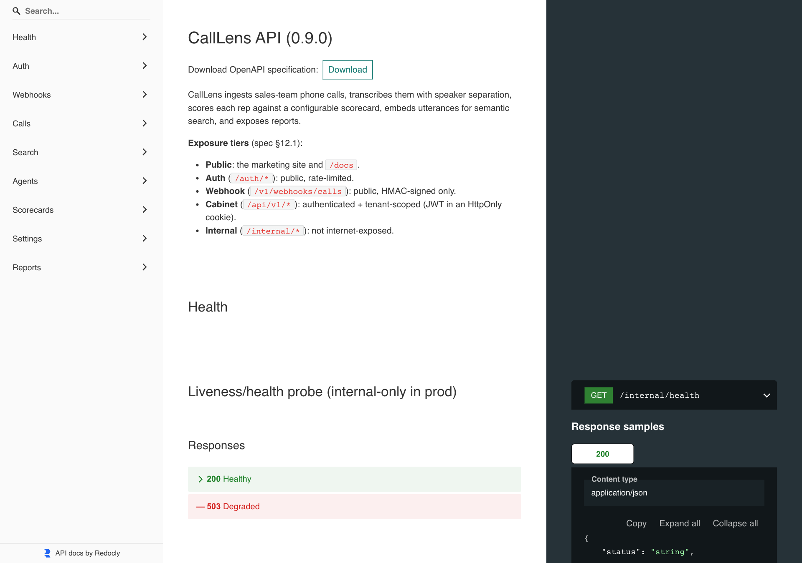

# CallLens HTTP API Reference

This catalogs the **current** HTTP endpoints of the CallLens API, grouped by
**exposure** (per README §12.1). Network/firewall + Nginx + auth enforce these
exposure boundaries; this document reflects the routes actually defined in the
controllers.

> **Conventions.** JSON request/response bodies unless noted. Error responses use
> the shape `{"error": "<message>"}`. Auth cookies: `access_token` and
> `refresh_token` (the latter scoped to `/auth/refresh`).

---

## Public

### `GET /internal/health`
- **Auth:** none (but **internal-only in production** — bound to the internal
  network / IP allow-list, not internet-exposed; see README §12.1).
- **Request:** none.
- **Response:** `200 OK` when healthy, `503 Service Unavailable` when degraded.

```json
{
  "status": "ok",
  "service": "calllens-api",
  "checks": { "database": "ok" }
}
```
`status` is `degraded` and HTTP `503` if any check (currently `database`) is `down`.

### `POST /auth/register`
- **Auth:** none. **Rate-limited** per client IP (`429 Too Many Requests` on excess).
- **Request:**

```json
{ "email": "boss@prodaj.com.ua", "password": "min-8-chars", "name": "Boss", "workspace": "Optional workspace name" }
```
`workspace` is optional.
- **Response:** `201 Created` with the user payload (see [User payload](#user-payload)).
- **Errors:** `422` (invalid email, password < 8 chars, or empty name), `409` (e.g. email already registered), `429` (rate limit).

### `POST /auth/login`
- **Auth:** none. Handled by the `json_login` firewall authenticator (the
  controller body is never executed).
- **Request:** JSON credentials (email + password).
- **Response:** on success, sets the `access_token` / `refresh_token` cookies.

### `POST /auth/refresh`
- **Auth:** valid refresh token (cookie, scoped to `/auth/refresh`). Handled by the
  `refresh_jwt` authenticator. Refresh tokens are single-use / rotating; reuse is rejected.
- **Response:** rotates and re-issues the auth cookies.

### `POST /auth/logout`
- **Auth:** none required (stateless).
- **Response:** `204 No Content`; clears the `access_token` (`/`) and
  `refresh_token` (`/auth/refresh`) cookies. The rotating refresh token also self-expires.

### `GET /auth/me`
- **Auth:** **required** (authenticated principal).
- **Response:** `200 OK` with the [User payload](#user-payload).

### `POST /auth/password/forgot`
- **Auth:** none. Rate-limited per IP (`password_reset` limiter).
- **Request:** `{ "email": "…" }`.
- **Response:** **always** `204 No Content` — never reveals whether the address
  has an account. If it does, a single-use reset link (1-hour TTL) is emailed.

### `POST /auth/password/reset`
- **Auth:** none (the token is the proof).
- **Request:** `{ "token": "…", "password": "…" }` (min 8 chars).
- **Response:** `204` on success; `422` if the token is invalid/expired or the
  password is too short. Also marks the email verified. The token is single-use.

### `POST /auth/email/verify`
- **Auth:** none (the token is the proof).
- **Request:** `{ "token": "…" }`.
- **Response:** `200 { "status": "verified" }`; `422` if invalid/expired. Single-use.

### `POST /auth/email/resend`
- **Auth:** **required.** Re-issues a verification email (no-op if already verified).
- **Response:** `204 No Content`.

### `GET /auth/google`
- **Auth:** none. Starts the Google OAuth flow.
- **Response:** `302` redirect to Google (scopes: `openid`, `email`, `profile`).

### `GET /auth/google/check`
- **Auth:** none. OAuth callback, handled by `GoogleAuthenticator` (the
  controller body is never executed).
- **Response:** establishes the session / auth cookies on success.

---

## Webhook (public, HMAC-signed)

### `POST /v1/webhooks/calls`
- **Auth:** **HMAC-SHA256 signature only** — no bearer token / cookie. Public,
  rate-limited, replay-protected, idempotent by `(tenant, call_id)`.
- **Required headers:** `X-CallLens-Endpoint` (endpoint UUID),
  `X-CallLens-Signature` (`sha256=<hmac>`), `X-CallLens-Timestamp`,
  `Content-Type: application/json`.
- **Request body:** `call_id` (required), `recording_url`, `agent_id`,
  `channels` (`mono`|`dual`, default `dual`), `language` (default `auto`),
  `started_at`, `duration_sec`.
- **Response:** `202 Accepted` → `{"status":"accepted","call_id":"…","duplicate":false}`.
- **Errors:** `401` (unknown endpoint / stale timestamp / invalid signature),
  `422` (invalid JSON / missing `call_id`).

> **Full contract:** see [`webhooks.md`](./webhooks.md) — headers, signing
> (`timestamp + "." + rawBody`), replay window (300s), idempotency, payload
> schema, dual-channel recommendation, and worked signing examples.

---

## Cabinet / authenticated (`/api/v1/*`)

Authenticated **and tenant-scoped**. The tenant is taken from the authenticated
principal (never from the request body).

### `GET /api/v1/calls/{id}/audio`
- **Auth:** **required** (`CurrentUser`), tenant-scoped. Streams the call's stored
  audio (`audio/wav` | `audio/mpeg` | …) for the cabinet `<audio>` player.
- **Responses:** `200 OK` (binary audio), `404` if the call is unknown or its
  audio has been deleted by retention.

### `POST /api/v1/calls/upload`
- **Auth:** **required** (`CurrentUser`). Tenant-scoped to the principal's tenant.
- **Request:** `multipart/form-data`.

| Field | Type | Required | Default | Notes |
|---|---|---|---|---|
| `audio` | file | **Yes** | — | The recording. Missing → `422`. Stored synchronously in object storage. |
| `external_id` | string | No | `upload-<uuidv7>` | Dedup key with the tenant. |
| `channels` | `mono`\|`dual` | No | `dual` | Anything but `mono` → `dual`. Dual-channel recommended. |
| `agent_external_id` | string | No | none | Auto-creates the agent on first sight. |
| `language` | string | No | `auto` | |

- **Responses:**
  - `202 Accepted` (new call) → `{"status":"accepted","id":"<call-uuid>","external_id":"…"}`. Audio is stored synchronously, then transcription is dispatched.
  - `200 OK` (duplicate `(tenant, external_id)`) → `{"status":"duplicate","id":"<call-uuid>","external_id":"…"}`.
- **Errors:** `422` when the `audio` field is missing.

### `POST /api/v1/search`
- **Auth:** **required** (`CurrentUser`). Results are scoped to the principal's
  tenant by the Doctrine tenant filter.
- **Request:** `application/json`.

| Field | Type | Required | Default | Notes |
|---|---|---|---|---|
| `query` | string | **Yes** | — | Natural-language query. Empty → `422`. |
| `limit` | int | No | `10` | Clamped to `1..50`. |

- **Behaviour:** embeds the query (`EmbeddingClient`) and runs cosine ANN
  (pgvector HNSW) over the tenant's utterance embeddings.
- **Response:** `200 OK` →
  `{"query":"…","results":[{"call_id":"<uuid>","speaker":"agent|customer","text":"…","score":0.93}, …]}`
  where `score` is cosine similarity (`1 − distance`), highest first.

### `GET|POST|PUT|DELETE /api/v1/scorecards`
- **Auth:** **required**, tenant-scoped. `GET` is open to any member; `POST` /
  `PUT /{id}` / `DELETE /{id}` require `ROLE_MANAGER`.
- **List:** returns the tenant's scorecards (each with `criteria`, `version`,
  `is_default`); when none exist, a read-only built-in default (`is_builtin: true`)
  is surfaced so calls are still scored.
- **Body (create/update):** `{ "name": "…", "is_default": bool, "criteria": [ { "key", "title", "weight", "max_score", "guidance" }, … ] }`. Updating bumps `version`; setting `is_default` clears it on the others.

### `GET /api/v1/team`
- **Auth:** **required**, tenant-scoped. Lists members (`name`, `email`, `role`,
  `email_verified`, `is_self`).

### `POST /api/v1/team/invite`
- **Auth:** `ROLE_ADMIN`. **Body:** `{ "email", "name", "role" }`.
- **Response:** `201` `{ "member": {…}, "temporary_password": "…" }`. Only an owner
  may grant the `owner` role; duplicate email → `409`.

### `PUT /api/v1/team/{id}/role`
- **Auth:** `ROLE_ADMIN`. **Body:** `{ "role" }`. Guardrails: you can't change your
  own role, only an owner can grant `owner`, and the workspace must keep ≥1 owner.

### `DELETE /api/v1/team/{id}`
- **Auth:** `ROLE_ADMIN`. Removes a member; you can't remove yourself or the last owner.

> Other cabinet resources (agents, reports, settings) follow the same
> tenant-scoped, cookie-authenticated pattern.

---

## User payload

Returned by `POST /auth/register` and `GET /auth/me`:

```json
{
  "id": "<user-uuid>",
  "email": "boss@prodaj.com.ua",
  "name": "Boss",
  "role": "<role>",
  "emailVerified": false,
  "tenant": {
    "id": "<tenant-uuid>",
    "name": "Workspace",
    "slug": "workspace"
  }
}
```

---

## OpenAPI & ReDoc (M9)

- The **OpenAPI 3.1 spec** is committed at [`docs/api/openapi.json`](./api/openapi.json)
  (the canonical artifact, per README §12.2) and covers every endpoint above.
- It is rendered with **ReDoc** at the **internal** route **`GET /internal/docs`**
  (network-restricted in prod), with the raw spec at `GET /internal/openapi.json`.
- The **public** docs site (`/docs`) carries a curated **webhook integration
  reference** (`/docs/webhooks`); the full reference stays internal.

> The endpoints are plain Symfony controllers (not yet `#[ApiResource]`), so the
> spec is currently **hand-maintained** alongside the code rather than generated by
> API Platform. Migrating the cabinet resources to API Platform for fully automatic
> generation (and CI doc-drift checks) is a refinement.


