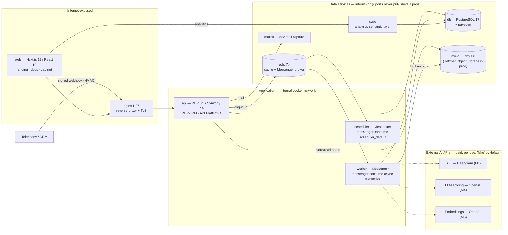

# Architecture

CallLens is an API-first AI SaaS that ingests sales-team phone calls, transcribes
them with speaker separation, scores each rep against a configurable scorecard with
an LLM, builds embeddings for semantic search, and exposes reports and analytics.

This document describes the system that exists today and links each concept back to
the canonical brief in [`../README.md`](../README.md) (§3 architecture, §4 stack,
§5 layout, §12 exposure, §16 security, §17 infra).

> **Build status. M0–M10 are done:** M0 scaffolding (monorepo, full Docker Compose
> stack, base Symfony + Next.js), M1 auth & tenancy (email + Google sign-in, JWT
> cookie sessions, Doctrine tenant filter, audit log), M2 ingestion + pipeline
> (signed webhook + upload, object storage, Messenger + Workflow), M3 Deepgram STT,
> M4 OpenAI scoring with evidence validation, M5 pgvector embeddings & semantic
> search, M6 the cabinet, M7 Cube analytics, M8 audio retention, M9 docs & API docs
> (landing, docs site, OpenAPI/ReDoc), M10 security hardening (headers, CSRF, CI +
> dependency audits). Real STT/LLM/embedding providers sit behind env-selected
> factories with `fake` defaults. **Remaining:** M11 deploy & ops (see README §21).

---

## 1. Component diagram

The services below are exactly those defined in
[`../docker-compose.yml`](../docker-compose.yml) plus the dev-only services
(`minio`, `mailpit`) from the local override. The same compose base runs in
production via `docker-compose.prod.yml`.



Dashed edges to the external AI providers go through interfaces with env-selected
implementations: real clients (Deepgram, OpenAI) ship today, with deterministic
`fake` implementations as the default so the pipeline runs with no paid calls.

### Exposure model

Only `nginx` and `web` publish host ports (README §12.1, §16). Every data service
(`db`, `redis`, `cube`, `minio`, `mailpit`) is attached to the `internal` docker
bridge network and is reachable on that network only. The local
`docker-compose.override.yml` is what maps their ports to the host for debugging;
in production the host firewall exposes only 80/443.

| Group | Surface | Exposure |
|---|---|---|
| Public site | `/`, `/docs/*` (web) | Public |
| Auth | `/auth/*` | Public, rate-limited |
| Webhook ingest | `POST /v1/webhooks/calls` | Public, HMAC-signed, replay-protected |
| Cabinet API | `/api/v1/*` | Authenticated + tenant-scoped |
| Internal / ops | `/internal/*` (health, OpenAPI/ReDoc, queue admin) | Not internet-exposed |

---

## 2. Request paths

### Synchronous path — webhook → `202`

The ingest controller does only fast, in-request work and returns immediately:

1. Verify the HMAC-SHA256 signature against the `WebhookEndpoint` secret and reject
   stale timestamps / replays (`Security/WebhookSignatureVerifier`).
2. Store the audio reference in object storage (`Infrastructure/Storage`).
3. Create `Call(received)`, deduplicating by `(tenant_id, external_id)`.
4. Dispatch `IngestCallMessage` onto the Redis Messenger transport.
5. Return **`202 Accepted`** in milliseconds — processing is asynchronous.

### Asynchronous path — worker pipeline

The `worker` service consumes the `transcribe` queue; the call's `status` is a
Symfony Workflow state machine driven by one idempotent, retryable handler per
stage (`Application/Message/*Message` + `Application/Pipeline/*Handler`):

```
received → transcribing → transcribed → scoring → scored → embedding → completed
                  └────────────── failed (any step, with retries) ──────────────┘
```

| Message | Handler | Stage | Status |
|---|---|---|---|
| `IngestCallMessage` | `IngestCallHandler` | persist call + audio ref, dispatch transcribe | `received` |
| `TranscribeCallMessage` | `TranscribeCallHandler` | `SpeechToTextClient` → transcript + utterances | `transcribed` |
| `ScoreCallMessage` | `ScoreCallHandler` | `ScoringClient` (structured output) → scores | `scored` |
| `EmbedCallMessage` | `EmbedCallHandler` | `EmbeddingClient` → utterance vectors | `completed` |

`Application/Pipeline/StepRunner` wraps each handler to record a `ProcessingEvent`
per attempt. Provider calls currently resolve to the `fake` implementations in
`Infrastructure/Provider/Fake` (`FakeSpeechToText`, `FakeScoring`, `FakeEmbedding`),
so the whole pipeline runs end-to-end with no paid API calls. Real providers —
Deepgram STT (M3), OpenAI scoring (M4) and embeddings (M5) — are implemented
behind `*ClientFactory` env selectors; `fake` remains the default.

The `scheduler` service consumes `scheduler_default` for housekeeping — the daily
audio-retention sweep (M8) is registered in `MainSchedule`.

---

## 3. DDD layering

The Symfony API (`apps/api/src`) follows a Domain/Application/Infrastructure/Api/Security
split (README §5, §20):

| Layer | Path | Responsibility |
|---|---|---|
| **Domain** | `Domain/` | Entities, value objects, enums and contracts per aggregate: `Agent`, `Audit`, `Auth`, `Call`, `Scorecard`, `Tenant`, `User`, `Webhook`. Defines the `TenantOwned` marker interface. |
| **Application** | `Application/` | Use cases and orchestration: `Auth`, `Ingestion`, `Message` (Messenger messages), `Pipeline` (handlers + `StepRunner`), `Provider` (STT/LLM/embedding interfaces), `Schedule`. |
| **Infrastructure** | `Infrastructure/` | Adapters: `Doctrine` (repositories + the `TenantFilter`), `Provider/Fake`, `Storage` (Flysystem/S3), `Tenant` (`TenantContext`, `TenantFilterConfigurator`), `Console`. |
| **Api** | `Api/`, `ApiResource/` | API Platform 4 resources, controllers and DTOs that expose the application layer over HTTP. |
| **Security** | `Security/` | `WebhookSignatureVerifier`, `GoogleAuthenticator`, `Voter/TenantVoter`, `EventListener/LoginAuditListener`. |

Bundles in use (`apps/api/config/bundles.php`): FrameworkBundle, DoctrineBundle +
Migrations, API Platform, SecurityBundle, Lexik JWT + Gesdinet JWT refresh, KnpU
OAuth2 client, Flysystem.

### Multi-tenancy

Every tenant-owned entity implements `Domain\Tenant\TenantOwned`. The Doctrine SQL
filter `Infrastructure/Doctrine/Filter/TenantFilter` appends
`tenant_id = :current_tenant` to every query for those entities. It is enabled
per-request by `Infrastructure/Tenant/TenantFilterConfigurator`, which runs on
`kernel.request` at a priority **below** the firewall (priority 6 vs the firewall's
8) so the authentication / user-provider query itself is never scoped. See
[ADR-0004](adr/0004-doctrine-tenant-filter.md).

---

## 4. Architecture decisions

Significant decisions are recorded as ADRs under [`adr/`](adr/):

- [ADR-0001 — API-first, no GPU](adr/0001-api-first-no-gpu.md)
- [ADR-0002 — Nginx + PHP-FPM (FrankenPHP rejected)](adr/0002-nginx-php-fpm.md)
- [ADR-0003 — JWT in HttpOnly cookie](adr/0003-jwt-in-httponly-cookie.md)
- [ADR-0004 — Doctrine tenant filter](adr/0004-doctrine-tenant-filter.md)
