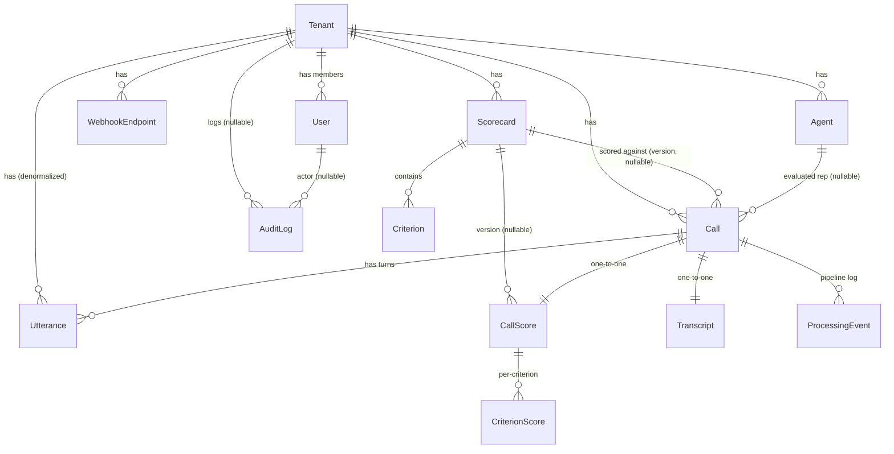

# CallLens — Data Model

This document describes the persistent data model of CallLens (an AI SaaS that
transcribes and scores sales calls). It is derived directly from the Doctrine
entities under `apps/api/src/Domain/` (the source of truth) and the tenancy
infrastructure under `apps/api/src/Infrastructure/`.

> **UUID v7 primary keys.** Every entity uses a `uuid` primary key generated in
> application code with `Symfony\Component\Uid\Uuid::v7()` (time-ordered v7
> UUIDs). IDs are assigned in the constructor, not by the database. The mapping
> is `#[ORM\Id] #[ORM\Column(type: 'uuid', unique: true)]` on every entity.

---

## Entity-Relationship Diagram



Notes on the diagram:

- `RefreshToken` is intentionally omitted from the ERD — it is an
  authentication-infrastructure table (extends the gesdinet base entity) with no
  ORM associations to domain entities.
- `Criterion` and `CriterionScore` are linked only by a non-foreign-key
  `criterion_key` string (see those sections); there is no ORM association
  between them.

---

## Tenant

- **Table:** `tenant`
- **Repository:** `TenantRepository`
- **Key fields:**
  - `id` — `uuid` (PK, v7)
  - `name` — `string(120)`
  - `slug` — `string(140)`, **unique**
  - `settings` — `json` (per-tenant settings: `audio_retention`, `locale`,
    default scorecard, etc.); defaults to `[]`
  - `createdAt` — `datetime_immutable`
- **Relationships:** Root of the tenancy tree. Referenced (ManyToOne) by every
  `TenantOwned` entity plus `AuditLog`. The `Tenant` entity itself is **not**
  `TenantOwned`.

## User

- **Table:** `app_user`
- **Repository:** `UserRepository`
- **Implements:** `UserInterface`, `PasswordAuthenticatedUserInterface`,
  `TenantOwned`
- **Constraints / indexes:**
  - `uniq_user_email` — unique on `email` (**globally unique**, see note)
  - `uniq_user_google_id` — unique on `google_id`
  - `idx_user_tenant` — index on `tenant_id`
- **Key fields:**
  - `id` — `uuid` (PK, v7)
  - `tenant` — ManyToOne → `Tenant`, `JoinColumn(nullable: false, onDelete: CASCADE)`
  - `email` — `string(180)`; lower-cased on construction
  - `passwordHash` — `string(255)`, nullable (column `password_hash`); null when
    the account is Google-only
  - `googleId` — `string(64)`, nullable (column `google_id`)
  - `name` — `string(120)`
  - `role` — **enum `Role`** (column default `viewer`), default `Role::Viewer`
  - `emailVerifiedAt` — `datetime_immutable`, nullable (column `email_verified_at`)
  - `createdAt` — `datetime_immutable`
- **`Role` enum** (`string`-backed) — workspace roles, hierarchy
  `owner > admin > manager > viewer`:
  - `Owner = 'owner'`
  - `Admin = 'admin'`
  - `Manager = 'manager'`
  - `Viewer = 'viewer'`
  - `asSecurityRole()` maps to `ROLE_<UPPER>` (e.g. `ROLE_ADMIN`).
    `getRoles()` returns `[<security role>, 'ROLE_USER']`.
- **Note (M1):** email is enforced **globally unique** (not per-tenant) so the
  security user provider can resolve a login by email alone. Per-tenant-only
  uniqueness with workspace-scoped login is a later enhancement.
- **Relationships:** belongs to one `Tenant`; referenced (nullable) by `AuditLog`.

## RefreshToken

- **Table:** `refresh_token`
- **Key fields:** Inherited from
  `Gesdinet\JWTRefreshTokenBundle\Entity\RefreshToken` (the bundle base entity —
  refresh-token string, username, valid-until). CallLens adds no fields.
- **Behavior:** Persisted, rotating, single-use refresh tokens; rotation
  invalidates the old token on each refresh (reuse detection). Not `TenantOwned`;
  no domain associations.

## AuditLog

- **Table:** `audit_log`
- **Repository:** `AuditLogRepository`
- **Indexes:** `idx_audit_tenant_created` on (`tenant_id`, `created_at`)
- **Key fields:**
  - `id` — `uuid` (PK, v7)
  - `tenant` — ManyToOne → `Tenant`, nullable, `onDelete: SET NULL`
  - `user` — ManyToOne → `User`, nullable, `onDelete: SET NULL`
  - `action` — `string(80)`
  - `target` — `string(180)`, nullable
  - `ip` — `string(45)`, nullable
  - `metadata` — `json`
  - `createdAt` — `datetime_immutable`
- **Purpose:** Security-relevant action log (sign-ins, secret regeneration,
  scorecard/retention changes, deletions).
- **Relationships:** optional `Tenant` and `User`. **Not** `TenantOwned` — the
  tenant link is nullable and rows survive tenant/user deletion via `SET NULL`,
  so it is not auto-scoped by the tenant filter.

## WebhookEndpoint

- **Table:** `webhook_endpoint`
- **Repository:** `WebhookEndpointRepository`
- **Implements:** `TenantOwned`
- **Indexes:** `idx_webhook_tenant` on `tenant_id`
- **Key fields:**
  - `id` — `uuid` (PK, v7)
  - `tenant` — ManyToOne → `Tenant`, `nullable: false`, `onDelete: CASCADE`
  - `signingSecret` — `string(80)` (column `signing_secret`); HMAC secret,
    defaults to `bin2hex(random_bytes(32))`, regenerable via `regenerateSecret()`
  - `sourceType` — `string(40)` (column `source_type`); free-form label, e.g.
    `twilio | binotel | ringostat | bitrix24 | generic`
  - `isActive` — `bool` (column `is_active`), default `true`
  - `createdAt` — `datetime_immutable`
- **Purpose:** Per-tenant ingest source; verifies HMAC-signed webhook payloads. A
  tenant may have several (one per telephony source).
- **Relationships:** belongs to one `Tenant`.

## Agent

- **Table:** `agent`
- **Repository:** `AgentRepository`
- **Implements:** `TenantOwned`
- **Constraints:** `uniq_agent_tenant_external` — unique on
  (`tenant_id`, `external_id`)
- **Key fields:**
  - `id` — `uuid` (PK, v7)
  - `tenant` — ManyToOne → `Tenant`, `nullable: false`, `onDelete: CASCADE`
  - `externalId` — `string(120)`, nullable (column `external_id`); maps the
    customer's CRM/telephony id so webhook payloads can reference reps by their
    own ids
  - `name` — `string(120)`
  - `isActive` — `bool` (column `is_active`), default `true`
- **Purpose:** A sales rep being evaluated.
- **Relationships:** belongs to one `Tenant`; referenced (nullable) by `Call`.

## Scorecard

- **Table:** `scorecard`
- **Repository:** `ScorecardRepository`
- **Implements:** `TenantOwned`
- **Indexes:** `idx_scorecard_tenant` on `tenant_id`
- **Key fields:**
  - `id` — `uuid` (PK, v7)
  - `tenant` — ManyToOne → `Tenant`, `nullable: false`, `onDelete: CASCADE`
  - `name` — `string(120)`
  - `version` — `int`, default `1`
  - `isDefault` — `bool` (column `is_default`), default `false`
  - `criteria` — OneToMany → `Criterion` (mappedBy `scorecard`,
    cascade persist/remove, orphanRemoval)
  - `createdAt` — `datetime_immutable`
- **Purpose:** A versioned set of scoring criteria. A call records the scorecard
  version it was scored against, so historical scores stay reproducible.
- **Relationships:** belongs to one `Tenant`; owns many `Criterion`; referenced
  (nullable) as the scored-against version by `Call` and `CallScore`.

## Criterion

- **Table:** `criterion`
- **Constraints:** `uniq_criterion_scorecard_key` — unique on
  (`scorecard_id`, `criterion_key`)
- **Key fields:**
  - `id` — `uuid` (PK, v7)
  - `scorecard` — ManyToOne → `Scorecard` (inversedBy `criteria`),
    `nullable: false`, `onDelete: CASCADE`
  - `key` — `string(60)` (column `criterion_key`); e.g. `greeting`,
    `needs_discovery`, `objection_handling`, `next_step`
  - `title` — `string(160)`
  - `weight` — `float`, default `1.0`
  - `maxScore` — `int` (column `max_score`), default `5`
  - `guidance` — `text`, nullable; fed to the LLM scorer
- **Note:** No dedicated repository class. Not `TenantOwned` itself — it is
  scoped transitively through its parent `Scorecard`.
- **Relationships:** belongs to one `Scorecard`.

## Call

- **Table:** `call`
- **Repository:** `CallRepository`
- **Implements:** `TenantOwned`
- **Constraints / indexes:**
  - `uniq_call_tenant_external` — unique on (`tenant_id`, `external_id`)
    (ingestion deduplicates by this pair)
  - `idx_call_tenant_status` — on (`tenant_id`, `status`)
  - `idx_call_started` — on `started_at`
- **Key fields:**
  - `id` — `uuid` (PK, v7)
  - `tenant` — ManyToOne → `Tenant`, `nullable: false`, `onDelete: CASCADE`
  - `externalId` — `string(190)` (column `external_id`)
  - `agent` — ManyToOne → `Agent`, nullable, `onDelete: SET NULL`
  - `source` — `string(40)`
  - `audioObjectKey` — `string(255)`, nullable (column `audio_object_key`);
    object-storage key for the audio (see namespacing below)
  - `audioDeletedAt` — `datetime_immutable`, nullable (column `audio_deleted_at`);
    set by `markAudioDeleted()` which also clears `audioObjectKey`
  - `channels` — **enum `Channels`**, default `Channels::Dual`
  - `language` — `string(12)`, default `'auto'`
  - `startedAt` — `datetime_immutable`, nullable (column `started_at`)
  - `durationSec` — `int`, nullable (column `duration_sec`)
  - `status` — **enum `CallStatus`**, default `CallStatus::Received`; driven by a
    Symfony Workflow (the entity exposes `getStatus()`/`setStatus()` as the
    workflow marking-store accessors)
  - `scorecardVersion` — ManyToOne → `Scorecard` (column
    `scorecard_version_id`), nullable, `onDelete: SET NULL`
  - `createdAt` — `datetime_immutable`
- **`CallStatus` enum** (`string`-backed) — lifecycle states driven by the
  Symfony Workflow; flow is
  `received → transcribing → transcribed → scoring → scored → embedding →
  completed`, with `failed` reachable from any step:
  - `Received = 'received'`
  - `Transcribing = 'transcribing'`
  - `Transcribed = 'transcribed'`
  - `Scoring = 'scoring'`
  - `Scored = 'scored'`
  - `Embedding = 'embedding'`
  - `Completed = 'completed'`
  - `Failed = 'failed'`
- **`Channels` enum** (`string`-backed) — audio channel layout:
  - `Mono = 'mono'` — needs provider diarization
  - `Dual = 'dual'` — rep and customer on separate channels (preferred, no
    diarization needed)
- **Relationships:** belongs to one `Tenant`; optionally references one `Agent`
  and one `Scorecard` (the scored-against version). Has one `Transcript`
  (one-to-one, owned by `Transcript`), one `CallScore` (one-to-one, owned by
  `CallScore`), many `Utterance`, and many `ProcessingEvent`.

## Transcript

- **Table:** `transcript`
- **Repository:** `TranscriptRepository`
- **Key fields:**
  - `id` — `uuid` (PK, v7)
  - `call` — OneToOne → `Call`, `nullable: false`, `onDelete: CASCADE`
    (one transcript per call)
  - `language` — `string(12)`
  - `fullText` — `text` (column `full_text`)
  - `provider` — `string(40)`
  - `model` — `string(80)`
  - `createdAt` — `datetime_immutable`
- **Note:** Not `TenantOwned` itself — scoped transitively through `Call`.
- **Relationships:** one-to-one with `Call`.

## Utterance

- **Table:** `utterance`
- **Repository:** `UtteranceRepository`
- **Implements:** `TenantOwned`
- **Indexes:** `idx_utterance_call` on `call_id`; `idx_utterance_tenant` on
  `tenant_id`
- **Key fields:**
  - `id` — `uuid` (PK, v7)
  - `call` — ManyToOne → `Call`, `nullable: false`, `onDelete: CASCADE`
  - `tenant` — ManyToOne → `Tenant`, `nullable: false`, `onDelete: CASCADE`
    (**denormalized** — copied from `call->tenant()` at construction so semantic
    search can be tenant-scoped directly on this table)
  - `speaker` — **enum `Speaker`**
  - `startMs` — `int` (column `start_ms`)
  - `endMs` — `int` (column `end_ms`)
  - `text` — `text`
  - `embedding` — **`vector(1024)`** (pgvector, type `vector`, nullable), set by
    `setEmbedding(float[])`. Indexed with **HNSW** (`vector_cosine_ops`) for
    cosine ANN search. (M5)
  - `embeddedAt` — `datetime_immutable`, nullable (column `embedded_at`); set when
    the embedding is stored
- **`Speaker` enum** (`string`-backed) — who is speaking (scoring grounds only on
  the agent's turns):
  - `Agent = 'agent'`
  - `Customer = 'customer'`
- Tenant-scoped semantic search runs cosine ANN over this column
  (`UtteranceRepository::semanticSearch`, `POST /api/v1/search`); the `vector`
  Doctrine type + `cosine_distance` DQL come from `pgvector/pgvector`.
- **Relationships:** belongs to one `Call` and (denormalized) one `Tenant`.

## CallScore

- **Table:** `call_score`
- **Repository:** `CallScoreRepository`
- **Key fields:**
  - `id` — `uuid` (PK, v7)
  - `call` — OneToOne → `Call`, `nullable: false`, `onDelete: CASCADE`
    (one score per call)
  - `scorecardVersion` — ManyToOne → `Scorecard` (column
    `scorecard_version_id`), nullable, `onDelete: SET NULL`
  - `overallScore` — `float` (column `overall_score`)
  - `model` — `string(80)`
  - `criterionScores` — OneToMany → `CriterionScore` (mappedBy `callScore`,
    cascade persist/remove, orphanRemoval)
  - `createdAt` — `datetime_immutable`
- **Purpose:** The overall LLM score for a call against a scorecard version.
- **Note:** Not `TenantOwned` itself — scoped transitively through `Call`.
- **Relationships:** one-to-one with `Call`; references one `Scorecard` version;
  owns many `CriterionScore`.

## CriterionScore

- **Table:** `criterion_score`
- **Key fields:**
  - `id` — `uuid` (PK, v7)
  - `callScore` — ManyToOne → `CallScore` (inversedBy `criterionScores`),
    `nullable: false`, `onDelete: CASCADE`
  - `criterionKey` — `string(60)` (column `criterion_key`); references the
    scorecard `Criterion.key` by value, not by FK
  - `score` — `float`
  - `maxScore` — `int` (column `max_score`)
  - `evidenceQuote` — `text`, nullable (column `evidence_quote`); must appear
    verbatim in the transcript (validated at scoring time)
  - `rationale` — `text`, nullable
- **Note:** No dedicated repository class. Not `TenantOwned` — scoped
  transitively through `CallScore` → `Call`.
- **Relationships:** belongs to one `CallScore`.

## ProcessingEvent

- **Table:** `processing_event`
- **Repository:** `ProcessingEventRepository`
- **Indexes:** `idx_processing_call` on `call_id`
- **Status constants:** `STATUS_STARTED = 'started'`,
  `STATUS_SUCCEEDED = 'succeeded'`, `STATUS_FAILED = 'failed'`
- **Key fields:**
  - `id` — `uuid` (PK, v7)
  - `call` — ManyToOne → `Call`, `nullable: false`, `onDelete: CASCADE`
  - `step` — `string(40)` (e.g. `transcribe`, `score`, `embed`)
  - `status` — `string(20)` (one of the status constants)
  - `attempt` — `int`, default `1`
  - `error` — `text`, nullable
  - `startedAt` — `datetime_immutable` (column `started_at`)
  - `finishedAt` — `datetime_immutable`, nullable (column `finished_at`); set by
    `finish()`
- **Purpose:** Observability for each pipeline step and its retries — one row per
  attempt of each step, recording success or error.
- **Note:** Not `TenantOwned` itself — scoped transitively through `Call`.
- **Relationships:** belongs to one `Call`.

---

## Multi-Tenancy & Isolation

CallLens is a shared-schema multi-tenant system. Isolation is enforced
automatically at the ORM layer rather than by hand-written `WHERE` clauses.

### The `TenantOwned` marker interface

`App\Domain\Tenant\TenantOwned` is a marker interface with a single method:

```php
interface TenantOwned
{
    public function tenant(): Tenant;
}
```

Any entity implementing it is automatically tenant-scoped on reads. Business
code therefore never has to remember to filter by tenant.

**`TenantOwned` entities (Tenant-scoped):**

- `User`
- `WebhookEndpoint`
- `Agent`
- `Scorecard`
- `Call`
- `Utterance`

`Utterance` additionally **denormalizes** `tenant_id` onto its own table (copied
from the parent `Call` at construction) so tenant-scoped semantic search can hit
the utterance table directly.

Entities that are **not** `TenantOwned` but still belong to a tenant are scoped
**transitively** through a `TenantOwned` parent: `Criterion` (→ `Scorecard`),
`Transcript` / `CallScore` / `CriterionScore` / `ProcessingEvent` (→ `Call`).
`AuditLog` is deliberately not tenant-scoped (its tenant link is nullable and
rows persist via `SET NULL` after a tenant is deleted). `Tenant` and
`RefreshToken` have no tenant scoping.

### The Doctrine `tenant` SQL filter

`App\Infrastructure\Doctrine\Filter\TenantFilter` (a Doctrine `SQLFilter`) adds

```sql
<alias>.tenant_id = :current_tenant
```

to every query whose target entity implements `TenantOwned`. If the target is
not `TenantOwned`, or if the `tenant_id` parameter has not been set yet, it adds
no constraint (returns an empty string).

The filter is **enabled per-request after authentication** by
`App\Infrastructure\Tenant\TenantFilterConfigurator`, a `kernel.request`
subscriber:

- It runs at request priority **6**, deliberately **below the firewall**
  (priority 8), so the user-provider / authentication query itself is **never**
  tenant-scoped (otherwise login by global email could not resolve a user).
- Once the principal is resolved, it reads `user->tenant()->id()`, stores it in
  the request-scoped `App\Infrastructure\Tenant\TenantContext`, enables the
  `tenant` filter, and sets its `tenant_id` parameter to that UUID (as a string).

`TenantContext` is the request-scoped holder of the current tenant id, read by
the filter and by any code that needs to stamp new records with the active
tenant. (From M2 the tenant may also be resolved from a webhook endpoint rather
than an authenticated user.)

### Object-storage key namespacing

Call audio is stored in object storage under a per-tenant, per-call key:

```
tenants/{tenantId}/calls/{callId}/audio.{ext}
```

This namespacing is applied consistently at every write site —
`IngestCallHandler` (webhook ingestion), `CallUploadController` (direct upload) —
and documented on `FlysystemObjectStorage`. The resulting key is persisted on
`Call.audioObjectKey`; `Call.markAudioDeleted()` clears the key and stamps
`audioDeletedAt` when audio is purged per the tenant's retention policy.
