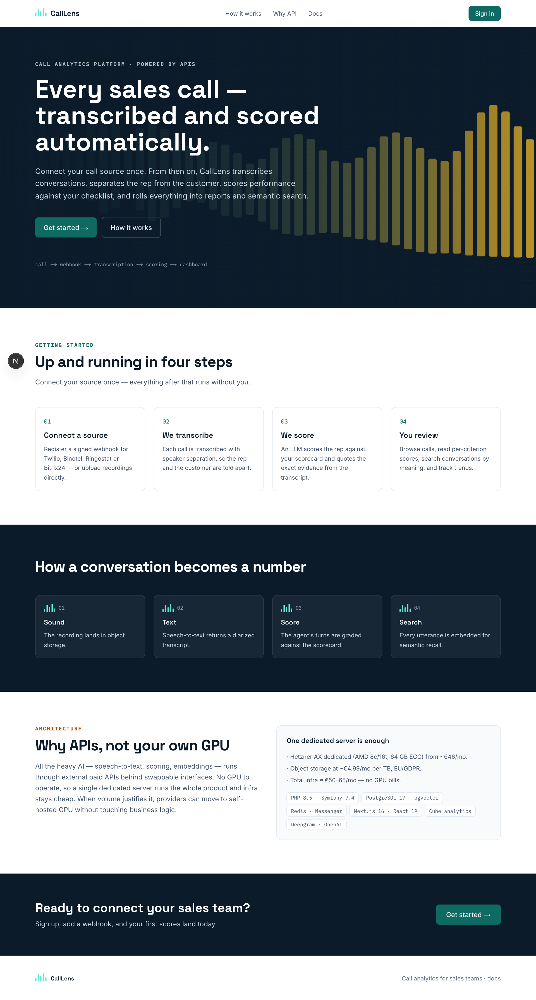
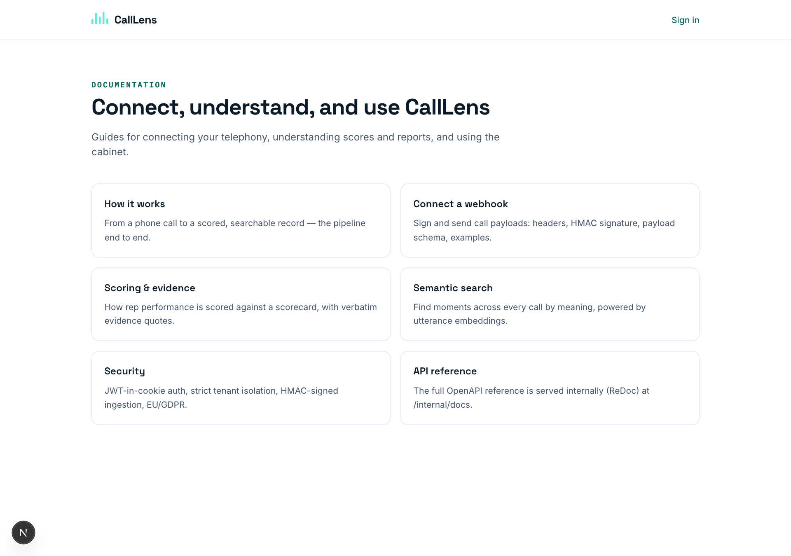

# Frontend (Next.js)

The web frontend lives in `apps/web` and is a single **Next.js 16 (App Router)**
application built with **React 19** and **Tailwind CSS v4**. TypeScript is in
strict mode.

> **Status:** the **cabinet is built (M6)** — login, calls list/detail, semantic
> search, agents, scorecards and settings, talking to the API with cookie auth
> over CORS. The marketing landing (`/`) and public docs site (`/docs`) are built
> (M9); richer settings are refinements (the scorecard editor shipped).

```
apps/web/
├─ app/
│  ├─ layout.tsx              # root layout — brand fonts (Space Grotesk/Inter/IBM Plex Mono)
│  ├─ globals.css             # Tailwind v4 + @theme brand tokens (ink/brand/api)
│  ├─ (marketing)/page.tsx    # "/"       — marketing landing (M9)
│  ├─ docs/page.tsx           # "/docs"   — docs index (M9)
│  ├─ docs/webhooks/page.tsx  # "/docs/webhooks" — webhook integration reference (M9)
│  ├─ login/page.tsx          # "/login"  — sign in / create workspace
│  └─ app/                    # "/app/*"  — authenticated cabinet (M6)
│     ├─ layout.tsx           #   AuthProvider + guard + sidebar shell
│     ├─ calls/page.tsx       #   calls list (status filter)
│     ├─ calls/[id]/page.tsx  #   call detail: transcript + per-criterion scores + evidence
│     ├─ search/page.tsx      #   semantic search
│     ├─ analytics/page.tsx   #   Cube-backed dashboard (M7)
│     ├─ agents/page.tsx      #   agents
│     ├─ scorecards/page.tsx  #   scorecards (read)
│     └─ settings/page.tsx    #   webhook endpoints + retention
├─ lib/    api.ts (fetch client, credentials), auth.tsx (AuthProvider/useAuth)
├─ components/  Sidebar, Brand (Logo/Wave/ScoreBadge/StatusBadge), PageHeader
└─ package.json               # next 16.2.9, react 19.2.4, tailwindcss ^4
```

Auth is **same-origin**: the browser only talks to the web app, which proxies
`/api/*` and `/auth/*` to the backend (`next.config.ts` rewrites → `API_PROXY_TARGET`,
the `nginx` service). So the JWT cookie set by `/auth/login` is **first-party** and
works in every browser (no cross-origin/third-party-cookie issues). The API also
keeps CORS-with-credentials (`CORS_ALLOW_ORIGIN`) for direct access.

`next dev` / `next build` / `next start` via npm scripts. Flows are verified with
Playwright during development (login → cabinet, landing, docs); a committed
Vitest/Playwright suite is a planned refinement (`npm test` is currently a stub).

## Route areas

One app, three areas (spec §13):

1. **Landing (`/`)** — corporate marketing page (**Implemented, M9**): sticky nav,
   navy hero with an **animated waveform `<canvas>`** (`components/HeroCanvas.tsx`,
   respects reduced motion), four-step onboarding, the *sound → score* section,
   *why APIs not your own GPU*, the single-server/stack panel, CTA and footer — all
   on the brand tokens. Ported from `doc/html/landing.html`.
2. **Docs (`/docs`)** — public documentation site (**Implemented, M9**): an index of
   topics plus a curated **webhook integration reference** (`/docs/webhooks`) with the
   signing recipe, payload schema and examples. The full canonical docs live in this
   `docs/` folder; rendering them all as MDX in-app is a refinement.
3. **Cabinet (`/app`, authenticated)** — the product workspace. **Implemented (M6):**
   - Calls list (status filter) with links to detail.
   - Call detail: speaker-separated transcript, per-criterion scores with
     evidence quotes + rationale, overall score, "audio deleted" state.
   - Semantic search over utterances.
   - **Analytics dashboard** (`/app/analytics`, M7) — stat cards + bar/column
     charts from the Cube semantic layer (avg score per agent, calls per week,
     avg score per week, status breakdown).
   - Agents list; scorecards (read).
   - Settings: webhook endpoint URL + signing secret (regenerate/add) and the
     audio-retention policy.
   - Audio playback on the call detail (streams `GET /api/v1/calls/{id}/audio`).
   - *Refinements (later):* a full scorecard editor, team & roles management,
     a richer chart library.

Accessibility (keyboard, focus states, reduced motion), mobile-flawless
responsiveness, and TypeScript strict mode are baseline requirements for all
three areas.

## Design system

The design language is defined in `doc/html/branding.html` (interactive brand
guide) and `doc/html/landing.html` (reference landing).

> **Status:** the brand tokens are in the app — `app/globals.css` defines the
> Ink/Teal/Amber palette via Tailwind v4 `@theme` (so `bg-ink`, `text-brand-600`,
> etc. work), and `app/layout.tsx` loads Space Grotesk / Inter / IBM Plex Mono.
> The landing port (incl. the animated waveform hero) shipped in M9.

### Colors

Three values carry meaning: **Ink** (base/background/text), **Teal** (primary
brand and actions), **Amber** (the marker for *external paid APIs* — STT/LLM/
embeddings calls).

| Role | Token | Hex |
| --- | --- | --- |
| Ink · base | Ink | `#0C1B2A` |
| Ink 800 | | `#0A1622` |
| Ink 700 | | `#10314A` |
| Ink 600 | | `#1B4763` |
| Teal · primary (●) | Teal 500 | `#0F766E` |
| Teal 600 | | `#0E6A63` |
| Teal 300 (on dark) | | `#5EEAD4` |
| Teal 100 | | `#CDE6E2` |
| Teal 50 | | `#E6F2F0` |
| Amber · external API (●) | Amber 300 | `#FBBF24` |
| Amber 600 | | `#B45309` |

Teal `#0F766E` is the primary on light backgrounds; Teal `#5EEAD4` is the
primary on Ink (dark) backgrounds. Amber is reserved for indicating external
paid-API activity and must not be used as a generic accent.

### Typography

Loaded via Google Fonts:

- **Space Grotesk** (400–700) — display / headings / the `CallLens` wordmark (Bold).
- **Inter** (400–700) — body / UI text.
- **IBM Plex Mono** (400–500) — labels, eyebrows, code, hex values, metadata.

### Waveform motif

The brand mark is an animated **sound wave** — the canonical form is **five
bars** — paired with the `CallLens` wordmark in Space Grotesk Bold. It
represents a live call being turned into data and is the recurring visual motif
across landing, docs, and cabinet. Do not stretch/skew it, change the bar count,
recolor it off-brand, or place it on busy backgrounds.

## Milestone summary

| Area | Status |
| --- | --- |
| App scaffold + Tailwind v4 `@theme` brand tokens + brand fonts | ✅ Implemented |
| Cabinet: login, calls list/detail, semantic search, agents, scorecards, settings | ✅ Implemented (M6) |
| Cabinet analytics dashboard (Cube) `/app/analytics` | ✅ Implemented (M7) |
| Call audio playback (streamed `/api/v1/calls/{id}/audio`) | ✅ Implemented |
| Full scorecard editor, team & roles management | Planned (later) |
| Marketing landing (`/`) + public docs site (`/docs`) | ✅ Implemented (M9) |
| In-app MDX rendering of the full docs / richer scorecard editor | Planned (refinement) |
| Vitest + Playwright frontend tests | Planned |

## Cabinet screenshots

**Calls list (M6)**


**Call detail — transcript + per-criterion scores with evidence (M6)**


**Semantic search (M6)**


**Analytics dashboard — Cube semantic layer (M7)**


**Marketing landing (M9)**



**Public docs site (M9)**


