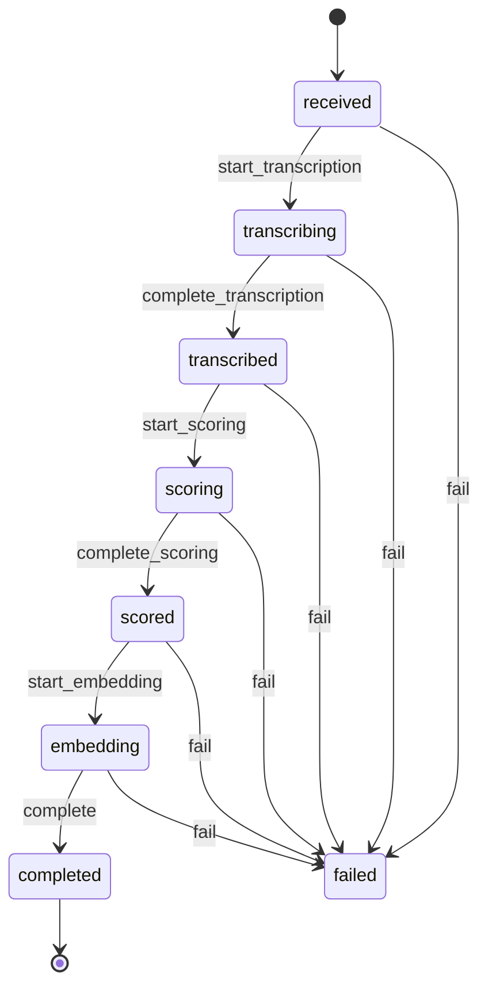

# Processing Pipeline

How an ingested call moves from raw audio to a scored, embedded, `completed`
record. The pipeline is a **Symfony Workflow** state machine driven by
**Symfony Messenger** messages, one handler per stage. Each handler is
idempotent and retryable.

> Status legend: shipped today vs. **Planned (Mx)** for work that is wired in the
> spec/README but not yet implemented in code.

---

## 1. Workflow state machine

Defined in [`config/packages/workflow.yaml`](../apps/api/config/packages/workflow.yaml).
It is a `state_machine` (single marking) named `call`, supporting
`App\Domain\Call\Call`, with a **method** marking store on the `status`
property (the entity exposes `getStatus()` / `setStatus()` returning the
`CallStatus` enum value). `initial_marking: received`.

### Places

`received`, `transcribing`, `transcribed`, `scoring`, `scored`, `embedding`,
`completed`, `failed`.

### Transitions (exactly as in `workflow.yaml`)

| Transition | From | To |
|---|---|---|
| `start_transcription` | `received` | `transcribing` |
| `complete_transcription` | `transcribing` | `transcribed` |
| `start_scoring` | `transcribed` | `scoring` |
| `complete_scoring` | `scoring` | `scored` |
| `start_embedding` | `scored` | `embedding` |
| `complete` | `embedding` | `completed` |
| `fail` | `received`, `transcribing`, `transcribed`, `scoring`, `scored`, `embedding` | `failed` |

`audit_trail` is enabled only when `kernel.debug` is true.

### State diagram



`fail` is reachable from every non-terminal place except `completed`. There is
no automatic transition out of `failed`; recovery is via re-dispatching the
relevant message (handlers are idempotent — see §5).

---

## 2. Messages, handlers, and transports

Messages live in
[`src/Application/Message/`](../apps/api/src/Application/Message); handlers in
[`src/Application/Pipeline/`](../apps/api/src/Application/Pipeline). Routing and
transports are in
[`config/packages/messenger.yaml`](../apps/api/config/packages/messenger.yaml).

| Message | Handler | Transport | DSN env |
|---|---|---|---|
| `IngestCallMessage(callId, recordingUrl)` | `IngestCallHandler` | `async` | `MESSENGER_TRANSPORT_DSN` |
| `TranscribeCallMessage(callId)` | `TranscribeCallHandler` | `transcribe` | `MESSENGER_TRANSCRIBE_DSN` |
| `ScoreCallMessage(callId)` | `ScoreCallHandler` | `async` | `MESSENGER_TRANSPORT_DSN` |
| `EmbedCallMessage(callId)` | `EmbedCallHandler` | `async` | `MESSENGER_TRANSPORT_DSN` |

Transcription gets its **own** `transcribe` transport so a slow STT provider
cannot starve scoring/embeddings — separate worker pools (spec §8). All other
pipeline messages share the `async` transport.

The `failed` transport is the Messenger **dead-letter / failure transport**
(`failure_transport: failed`, DSN `MESSENGER_FAILED_DSN`, a Doctrine queue by
default — `doctrine://default?queue_name=failed`). A message that exhausts its
retries lands there.

`sync://` exists for synchronous dispatch; under `when@test` both `async` and
`transcribe` are swapped to `in-memory://`.

> Retention is wired (M8): after `complete`, the embed handler dispatches
> `DeleteAudioMessage` when the tenant policy is `delete_after_processing`, and a
> daily `AudioRetentionSweep` handles `delete_after_days` — see
> [audio-retention.md](./audio-retention.md).

---

## 3. Per-step orchestration: `StepRunner`

[`StepRunner`](../apps/api/src/Application/Pipeline/StepRunner.php) wraps one
pipeline step inside the call's workflow. For each step it:

1. Creates a `ProcessingEvent(call, step, STARTED)` and saves it.
2. If the workflow `can()` the **start** transition, applies it and flushes.
3. Runs the step's `$work` closure (the actual provider call + persistence).
4. If the workflow `can()` the **complete** transition, applies it; flushes.
5. Marks the `ProcessingEvent` `SUCCEEDED`.

On any `\Throwable` it calls `markFailed()`: best-effort applies the `fail`
transition (guarded by `em->isOpen()` and `workflow->can()`), records the
`ProcessingEvent` as `FAILED` with the exception message, and **rethrows** so
Messenger's retry / dead-letter machinery (the source of truth) takes over.

The `can()` guards are what make re-runs safe: if a transition was already
applied on a previous attempt, it is skipped rather than throwing.

`TranscribeCallHandler`, `ScoreCallHandler`, and `EmbedCallHandler` all run
their work through `StepRunner`. `IngestCallHandler` does **not** use
`StepRunner` (ingestion happens before any workflow transition); it records its
own `ingest` `ProcessingEvent` inline.

---

## 4. ProcessingEvent records

[`ProcessingEvent`](../apps/api/src/Domain/Call/ProcessingEvent.php) — one row
per attempt of each step, for observability (spec §8). Columns: `id` (UUIDv7),
`call` (FK, `onDelete: CASCADE`), `step` (string ≤40), `status`
(`started` | `succeeded` | `failed`), `attempt` (int, default 1), `error`
(nullable text), `started_at`, `finished_at` (nullable). Indexed on `call_id`.

Steps emitted by the current handlers: `ingest`, `transcribe`, `score`,
`embed`. `finish(status, error)` stamps `finished_at` and (on failure) the
error message.

---

## 5. Idempotency

- **Ingestion dedup by `(tenant, external_id)`**: the `Call` table has a
  unique constraint `uniq_call_tenant_external (tenant_id, external_id)`
  (see [`Call`](../apps/api/src/Domain/Call/Call.php)), so a replayed webhook
  cannot create a duplicate call.
- **Each handler skips work already done**, then always dispatches the next
  stage (so a retried/replayed message still advances the pipeline):
  - `IngestCallHandler` — if `Call::isAudioAvailable()` (audio key already set),
    skips the download/store and just dispatches `TranscribeCallMessage`.
  - `TranscribeCallHandler` — if a `Transcript` already exists for the call,
    skips STT and dispatches `ScoreCallMessage`.
  - `ScoreCallHandler` — if a `CallScore` already exists, skips scoring and
    dispatches `EmbedCallMessage`. (Throws if there is no transcript yet.)
  - `EmbedCallHandler` — runs the embed step; with no utterances it is a no-op
    and still completes the call.
- Every handler first loads the call and returns early (no-op) if it is missing.
- The `StepRunner` `can()` guards (see §3) make the workflow transitions
  themselves idempotent.

Net effect: re-processing a call is safe (upsert semantics, README §8).

---

## 6. Retry strategy

From [`messenger.yaml`](../apps/api/config/packages/messenger.yaml):

| Transport | max_retries | delay (ms) | multiplier | Backoff |
|---|---|---|---|---|
| `async` | 3 | 1000 | 2 | 1s → 2s → 4s |
| `transcribe` | 3 | 2000 | 2 | 2s → 4s → 8s |
| `failed` | — (dead-letter) | — | — | — |

After retries are exhausted on a transport, the message is moved to the
`failed` (Doctrine dead-letter) transport for inspection/manual replay. When a
step throws, `StepRunner` has already transitioned the call to `failed` and
recorded a `failed` `ProcessingEvent`, so the call's status and the dead-letter
queue stay consistent.

> Per-provider timeouts and circuit breakers around each provider call are a
> reliability requirement in README §8 and are **Planned** (not yet in code).

---

## 7. End-to-end flow

### Happy path

```
Webhook (POST /v1/webhooks/calls)        Upload
        │  returns 202 immediately           │  controller stores audio,
        ▼                                     ▼  sets audio_object_key
  IngestCallMessage  ──[async]──► IngestCallHandler
        │  download recording, store to ObjectStorage,
        │  set audio_object_key, ProcessingEvent(ingest)
        ▼
  TranscribeCallMessage ──[transcribe]──► TranscribeCallHandler
        │  start_transcription → SpeechToTextClient.transcribe()
        │  persist Transcript + Utterances → complete_transcription
        ▼  (status: transcribed)
  ScoreCallMessage ──[async]──► ScoreCallHandler
        │  start_scoring → ScoringClient.score(transcript, scorecard)
        │  persist CallScore + CriterionScores → complete_scoring
        ▼  (status: scored)
  EmbedCallMessage ──[async]──► EmbedCallHandler
        │  start_embedding → EmbeddingClient.embed(utterance texts)
        │  mark utterances embedded → complete
        ▼  (status: completed)
      DONE
```

Two entry points:

1. **Webhook path** — the webhook controller persists `Call(received)` and
   dispatches `IngestCallMessage(callId, recordingUrl)` so the HTTP endpoint
   returns `202` in milliseconds without downloading audio inline. The handler
   fetches the recording over HTTP, stores it under
   `tenants/{tenantId}/calls/{callId}/audio.{ext}` (extension inferred from the
   URL, defaulting to `mp3`), sets `audio_object_key`, then dispatches
   `TranscribeCallMessage`.
2. **Upload path** — the audio is already in object storage and the call has its
   `audio_object_key`, so the pipeline begins directly at
   `TranscribeCallMessage` (ingest is a no-op if re-run, since the audio is
   already available).

From there: **transcribe → score → embed → completed**, each stage dispatching
the next on success.

`EmbedCallHandler` stores each embedding vector in the pgvector
`Utterance.embedding` column (M5), then applies `complete`. Once `completed`, the
retention policy is evaluated (M8): `delete_after_processing` dispatches audio
deletion immediately.

### Failure path

Any step that throws inside `StepRunner`:

1. The call transitions via `fail` to the `failed` place (best-effort).
2. A `ProcessingEvent` for that step is recorded with `status = failed` and the
   error message.
3. The exception is rethrown → Messenger retries with backoff per the step's
   transport (§6).
4. If all retries are exhausted, the message is dead-lettered to the `failed`
   transport for inspection/replay.

Because handlers are idempotent (§5), replaying a dead-lettered message resumes
the pipeline from where it left off without duplicating prior work.
