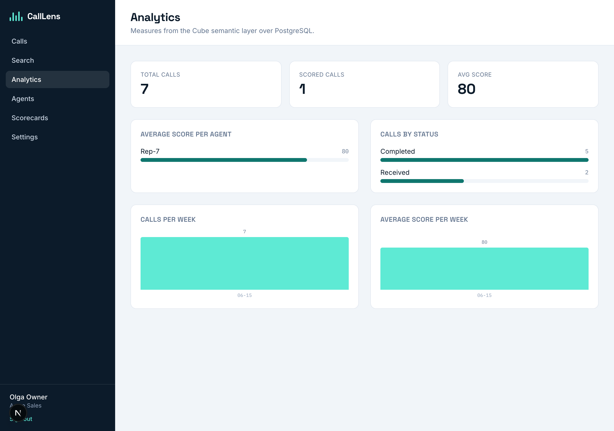

# Reports & Analytics (Cube)

CallLens serves dashboards through **Cube** — a semantic layer over PostgreSQL.
Measures and dimensions are defined once and exposed via Cube's REST/JS API to
the cabinet, with **pre-aggregations** and caching so reports stay fast on
Postgres alone. No separate search/analytics engine is used for reporting.

> **Status: Implemented (M7).** The Cube data model, a tenant-scoped reports API,
> and the cabinet analytics dashboard are all built. Postgres stays the source of
> truth; Cube only defines a query interface over existing tables.

## Semantic model (`services/cube/`)

`services/cube/model/calllens.yml` defines three cubes:

- **`calls`** (`public.call`) — `count`; dimensions `status`, `created_at`, `tenant_id`.
- **`agents`** (`public.agent`) — `name`, `tenant_id`.
- **`call_scores`** — its SQL joins `call` so `agent_id` / `tenant_id` / `status`
  are exposed directly. Measures `count`, **`avg_overall`** (avg of `overall_score`).
  Pre-aggregation **`by_agent_week`** rolls up avg score + count per agent per week.

**Tenant isolation:** `services/cube/cube.js` defines a `queryRewrite` that injects
a `tenant_id = securityContext.tenantId` filter on every query (for whichever of
`calls` / `call_scores` / `agents` the query touches). A query with no tenant in
the signed context is rejected.

## Reports API (the cabinet's data source)

The browser does **not** call Cube directly. `GET /api/v1/reports`
(`ReportsController`) runs the dashboard queries server-side via `CubeClient`,
which mints a short-lived **HS256 JWT** (signed with `CUBEJS_API_SECRET`) carrying
`{ tenantId }` as the Cube security context. This keeps Cube on the internal
network and guarantees tenant scoping. Panels degrade to empty series if Cube is
unavailable. It returns:

- `avg_score_per_agent` — `call_scores.avg_overall` by `agents.name`.
- `calls_per_week` — `calls.count` by week.
- `avg_score_per_week` — `call_scores.avg_overall` by week.
- `status_breakdown` — `calls.count` by `calls.status`.

## Cabinet dashboard

`/app/analytics` renders stat cards (total/scored calls, avg score) and bar/column
charts (lightweight SVG/CSS, no chart library) from `GET /api/v1/reports`.

## Scaling note

Cube + Postgres pre-aggregations are the reporting path. Elasticsearch/
OpenSearch is **only** introduced later if full-text relevance/faceting at scale
is needed — not for reporting, and not in the M7 scope.

## Configuration

Relevant env (see `docs/configuration.md`): `CUBEJS_API_SECRET` (`CUBE_API_SECRET`
in spec) and the shared Postgres connection. The Cube DB credentials mirror the
app's Postgres (`POSTGRES_DB` / `POSTGRES_USER` / `POSTGRES_PASSWORD`).

## Milestone summary

| Item | Status |
| --- | --- |
| `cube` service in Compose (dev playground `:4000`) | ✅ Implemented |
| Cube data model (`services/cube/`), measures/dimensions, `by_agent_week` pre-agg | ✅ Implemented (M7) |
| Tenant-scoped reports API (`/api/v1/reports`, signed Cube JWT) | ✅ Implemented (M7) |
| Cabinet analytics dashboard (`/app/analytics`) | ✅ Implemented (M7) |
| Top-objections panel, richer chart library | Planned (refinement) |
